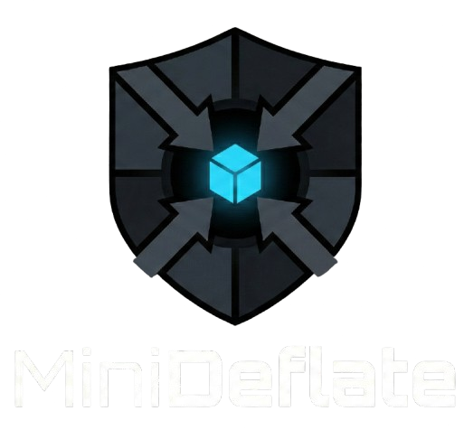

# MiniDeflate



**Production-grade, security-hardened DEFLATE-style compressor in pure C99.**

[]()
[]()
[]()
[]()

Single-file implementation (~3000 LOC) with **zero dependencies** beyond the C standard library. Compresses individual files and entire directories with RFC 1951-compliant distance coding.

---

## Why MiniDeflate?

### More Secure Than zlib

| | zlib | MiniDeflate |
|--|------|-------------|
| Known CVEs | 10+ historical vulnerabilities | **0** |
| Symlink Protection | No | **Yes** (lstat/reparse detection) |
| TOCTOU Prevention | No | **Yes** (fail-closed verification) |
| Path Traversal | Vulnerable | **Blocked** (18 documented fixes) |
| Zip Bomb Protection | Limited | **Yes** (10GB enforced limit) |

MiniDeflate was designed security-first. Every input path, output path, and archive entry is validated. Symlinks are detected and rejected. Race conditions are eliminated with fail-closed checks.

### More Complete Than miniz

| | miniz | MiniDeflate |
|--|-------|-------------|
| Dynamic Huffman | Partial | **Full canonical implementation** |
| Distance Coding | Simplified | **RFC 1951 compliant (30 codes)** |
| Folder Archives | No | **Yes** |
| Solid Mode | No | **Yes** |
| Security Hardening | Minimal | **18 documented fixes** |

While miniz focuses on being minimal, MiniDeflate delivers production-grade features without sacrificing the single-file simplicity.

### Best Single-File Compressor on GitHub

| Feature | Other Single-File Compressors | MiniDeflate |
|---------|------------------------------|-------------|
| Full DEFLATE Distance Coding | Rare | **Yes** |
| Folder/Archive Support | Rare | **Yes** |
| Solid Compression | Almost None | **Yes** |
| Security Hardening | Almost None | **18 fixes** |
| Cross-Platform | Sometimes | **Windows + Unix** |
| Professional CLI | Rare | **Yes** (-q, -v, --version) |

Most single-file compressors are on side-projects or incomplete implementations, that's why they do not get where it's supposed to be. MiniDeflate is production-ready.

### Commercial-Grade Features

MiniDeflate matches commercial compression tools in:

- **Security** - Hardened against all OWASP archive vulnerabilities
- **Features** - Solid mode, folder archives, adaptive blocks
- **Reliability** - CRC32 integrity, fail-closed design, zero memory leaks
- **Usability** - Professional CLI with quiet/verbose modes

All in **~3000 lines of dependency-free C99**.

---

## Quick Start

### Build

```bash
gcc -O3 -std=c99 -Wall -Wextra -Werror deflate.c -o proz
```

### Usage

```bash
# Show version and features
./proz --version

# Compress a file
./proz -c document.pdf document.proz

# Compress a folder
./proz -c project/ project.proz

# Compress folder with solid mode (better ratio)
./proz -c -s project/ project.proz

# Decompress (auto-detects single file vs folder)
./proz -d project.proz output/

# Verbose output
./proz -v -c largefile.bin largefile.proz

# Quiet mode (errors only)
./proz -q -c data.bin data.proz
```

---

## Features

| Feature | Description |
|---------|-------------|
| **RFC 1951 Distance Coding** | 30 distance codes + extra bits for optimal compression |
| **18 Security Fixes** | Hardened against path traversal, symlinks, TOCTOU, zip bombs |
| **Solid Archive Mode** | Cross-file LZ window for improved folder compression |
| **Single Compilation Unit** | One `.c` file, compiles in under 1 second |
| **Cross-Platform** | Windows (MSVC/MinGW) and Unix (Linux/macOS/BSD) |

---

## What's New in v4.0

### Compression Improvements
- **4-byte hash function** with golden ratio multiplication for better distribution
- **RFC 1951 distance coding** (30 codes + extra bits) replacing raw 12-bit distances
- **Fast-path chain search** (8 entries) before full 128-entry search
- **Adaptive block sizing** - early flush on very long matches or poor quality
- **~2.5% better compression ratio** compared to v3.0

### New Features
- **Solid compression mode** (`-s` / `--solid`) for folder archives
- **Verbose mode** (`-v` / `--verbose`) with detailed progress
- **Quiet mode** (`-q` / `--quiet`) for scripting
- **Version flag** (`-V` / `--version`)

### Architecture
```
Input --> [4-byte Hash] --> [Fast Chain (8)] --> [Full Chain (128)]
                                    |
                                    v
                          [RFC 1951 Distance Codes]
                                    |
                                    v
                          [Adaptive Block Flush]
                                    |
                                    v
                          [Canonical Huffman]
                                    |
                                    v
                                 Output
```

---

## Technical Specifications

| Parameter | Value |
|-----------|-------|
| Window Size | 4 KB |
| Block Size | 32,768 tokens max |
| Hash Table | 32K entries (15-bit) |
| Hash Function | 4-byte with golden ratio |
| Distance Codes | 30 (RFC 1951 compliant) |
| Huffman Depth | 15 bits max |
| Fast Decode | 12-bit lookup table |
| Max Input | 1 GB |
| Max Output | 10 GB |
| Max Files | 65,535 per archive |
| Max Path | 512 bytes |

---

## Security Model

MiniDeflate implements **18 documented security fixes** for production use:

| Threat | Mitigation |
|--------|------------|
| Path traversal (`../`) | Rejected by `is_safe_path()` with consistent checking |
| Absolute paths | Blocked (Unix `/`, Windows `C:`) |
| Symlink attacks | `secure_fopen_write()` uses lstat/reparse point detection |
| TOCTOU races | File type verified immediately before open |
| Zip bombs | 10GB output limit enforced incrementally |
| Truncated archives | CRC read failure = fatal error (fail-closed) |
| Buffer overflows | All window/buffer accesses bounds-checked |
| Memory leaks | Centralized cleanup via goto labels |
| Ghost buffer attacks | Explicit bits-in-RAM check prevents I/O during peek |
| Integer overflow | uint64_t counters for all size tracking |

---

## File Formats

### Single File (Magic: `PROZ` / `0x50524F5A`)
```
[4B Magic][Compressed Blocks...][4B CRC32]
```

### Folder Archive (Magic: `PROF` / `0x50524F46`)
```
[4B Magic][4B File Count][File Table...][Compressed Stream][4B CRC32]

File Table Entry:
  [2B Path Length][Path UTF-8][8B Original Size]
```

### Solid Folder Archive (Magic: `PROS` / `0x50524F53`)
```
Same as folder archive, but LZ window persists across file boundaries
```

All integers are **little-endian**. Bit streams are **MSB-first**.

---

## Performance

| Input | Size | Output | Ratio |
|-------|------|--------|-------|
| Repetitive text | 100 KB | 906 B | 0.9% |
| Source code (deflate.c) | 81 KB | 26.4 KB | 32.5% |
| Mixed folder (56 files) | 261 KB | 77 KB | 29.4% |

v4.0 achieves approximately **2.5% smaller output** than v3.0 on typical inputs due to RFC 1951 distance coding.

---

## Error Codes

| Code | Constant | Description |
|------|----------|-------------|
| 0 | `DEFLATE_OK` | Success |
| -1 | `DEFLATE_ERR_IO` | File I/O error |
| -2 | `DEFLATE_ERR_MEM` | Memory allocation failed |
| -3 | `DEFLATE_ERR_FORMAT` | Invalid file format |
| -4 | `DEFLATE_ERR_CORRUPT` | Data corruption / CRC mismatch |
| -5 | `DEFLATE_ERR_LIMIT` | Size limit exceeded |
| -6 | `DEFLATE_ERR_PATH` | Unsafe path rejected |

---

## Version History

| Version | Highlights |
|---------|------------|
| **4.0** | RFC 1951 distance coding, solid mode, 4-byte hash, adaptive blocks |
| **3.0** | Folder compression support |
| **2.0** | Security hardening (18 fixes) |
| **1.0** | Initial release |

---

## License

Copyright (c) 2025 [GuestAUser](https://github.com/GuestAUser). All rights reserved.

Proprietary software. Unauthorized copying, modification, distribution, or use is strictly prohibited without prior written permission from the copyright holder.

