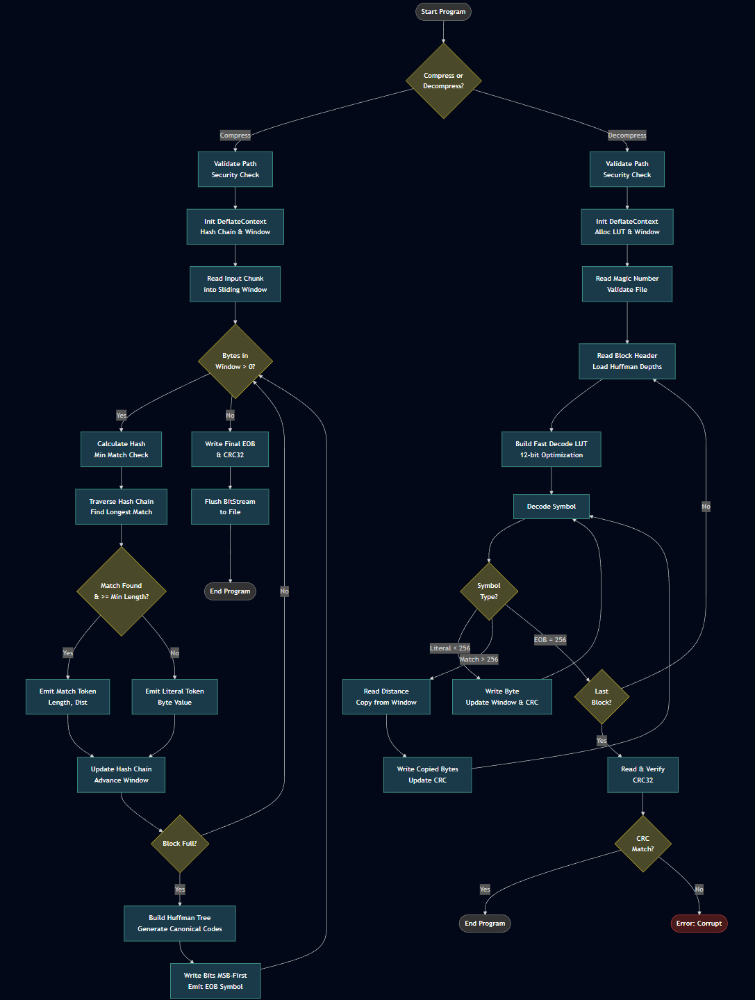

# MiniDeflate

A production-grade, security-hardened DEFLATE-style compressor in pure C99.

Single-file implementation with **zero dependencies** beyond the C standard library.



## Features

### Compression
- **Hash Chain LZSS** - O(1) pattern lookup via 32K-entry hash table
- **4KB Sliding Window** - Double-buffered for safe boundary handling
- **Canonical Huffman** - Optimal prefix codes rebuilt per 32KB block
- **12-bit Fast Decode** - O(1) symbol resolution via lookup table

### Security
- **Path Traversal Protection** - Rejects `..`, absolute paths, and dangerous characters
- **Symlink Attack Prevention** - Refuses to follow symlinks/reparse points on output
- **Zip Bomb Prevention** - Enforces 1GB input / 10GB output limits
- **Bounds-Safe Access** - All window/buffer accesses are clamped and verified
- **Fail-Closed Integrity** - Truncated files are rejected, not warned

### Robustness
- **No Memory Leaks** - All error paths properly free allocations (verified via static analysis)
- **Portable Serialization** - Little-endian byte-by-byte I/O, safe on any architecture
- **Consistent Error Propagation** - All failures return typed error codes
- **Debug Assertions** - Optional compile-time diagnostics via `-DDEBUG`

## Build

```bash
# Release build
gcc -O3 -std=c99 -Wall -Wextra deflate.c -o deflate

# Debug build (enables assertions)
gcc -O3 -std=c99 -Wall -Wextra -DDEBUG deflate.c -o deflate
```

Compiles clean with no warnings on GCC/Clang (Linux, macOS, Windows/MSYS2).

## Usage

```bash
./deflate -c input.txt compressed.bin   # Compress
./deflate -d compressed.bin output.txt  # Decompress
```

## Output

```
Compression Complete
Input:  100000 bytes
Output: 906 bytes
Ratio:  0.91%
CRC32:  0x8173048C
```

```
Decompression Complete
Output:       100000 bytes
Computed CRC: 0x8173048C
File CRC:     0x8173048C
Integrity Verified: OK
```

## Technical Specifications

| Parameter | Value | Notes |
|-----------|-------|-------|
| Max Input | 1 GB | Enforced during streaming |
| Max Output | 10 GB | Prevents decompression bombs |
| Window Size | 4 KB | Doubled internally for wraparound safety |
| Block Size | 32 KB | Huffman table rebuilt per block |
| Hash Table | 32K entries | 15-bit hash, 128-entry chain limit |
| Huffman Depth | 15 bits max | Canonical encoding |
| Fast Decode | 12 bits | Covers most common symbols |

## Error Codes

| Code | Constant | Description |
|------|----------|-------------|
| 0 | `DEFLATE_OK` | Success |
| -1 | `DEFLATE_ERR_IO` | File I/O error |
| -2 | `DEFLATE_ERR_MEM` | Memory allocation failed |
| -3 | `DEFLATE_ERR_FORMAT` | Invalid file format or magic |
| -4 | `DEFLATE_ERR_CORRUPT` | Data corruption or CRC mismatch |
| -5 | `DEFLATE_ERR_LIMIT` | Size limit exceeded |
| -6 | `DEFLATE_ERR_PATH` | Unsafe path rejected |

## Algorithm

```
┌─────────────┐     ┌─────────────┐     ┌─────────────┐
│   Input     │────▶│    LZSS     │───▶│   Huffman   │────▶ Output
│   Stream    │     │ (Hash Chain)│     │ (Canonical) │
└─────────────┘     └─────────────┘     └─────────────┘
                           │                    │
                    Literals or           Per-block
                    (len, dist)           optimal codes
```

1. **LZSS Stage** - Finds repeated patterns using hash chains; emits literals (0-255) or length-distance pairs (257-512)
2. **Huffman Stage** - Builds canonical prefix codes from symbol frequencies; stores only bit-depths (4 bits each)
3. **CRC32 Stage** - IEEE 802.3 polynomial computed incrementally; verified on decompression

## File Format

```
┌────────────┬─────────────────────┬────────────┐
│ Magic (4B) │      Blocks...      │ CRC32 (4B) │
│ 0x50524F5A │                     │ Little-End │
└────────────┴─────────────────────┴────────────┘

Block Structure:
┌─────────┬──────────┬─────────────┬──────────────┬─────┐
│ LastFlag│ MaxSym   │ Depths      │ Huffman Data │ EOB │
│ (1 bit) │ (16 bits)│ (4b × syms) │ (variable)   │     │
└─────────┴──────────┴─────────────┴──────────────┴─────┘
```

All multi-byte values are little-endian. Bit streams are MSB-first.

## Security Model

| Threat | Mitigation |
|--------|------------|
| Path traversal (`../`) | Rejected by `is_safe_path()` |
| Absolute paths | Rejected (Unix `/`, Windows `C:`) |
| Symlink attacks (TOCTOU) | `secure_fopen_write()` via lstat/reparse check |
| Zip bombs | 10GB output limit, checked incrementally |
| Truncated files | CRC read failure = fatal error |
| Buffer overflows | All indices bounds-checked |
| Integer overflows | `uint64_t` for size tracking |
| Memory leaks | Centralized cleanup via `goto` labels |
| Ghost buffer (state desync) | Explicit bits_in_ram check before peek |

## Corrections Applied

This implementation underwent rigorous review with 18 documented corrections:

1. Clear variable naming (`bytes_in_window` vs ambiguous `len`)
2. Heap overflow detection (`heap_push` returns bool)
3. Centralized memory cleanup (no double-free)
4. Documented bit I/O invariants (MSB-first)
5. Bounds-safe hash/window access
6. Mandatory error parameters (`bs_read_bits`)
7. Portable size tracking (`uint64_t`, no `ftell`)
8. Path validation consistency
9. Debug assertions (`-DDEBUG`)
10. Complete Huffman tree cleanup
11. Fail-closed CRC verification
12. Consistent path component checking
13. Mode assertions in bit writer
14. Accurate output byte counting
15. Heap destructor frees remaining nodes
16. Complete BitStream state save/restore
17. TOCTOU/Symlink prevention (`secure_fopen_write` via lstat/reparse)
18. Ghost buffer prevention (explicit bits_in_ram check before peek)

## Performance

Tested on representative data:

| Input | Compressed | Ratio | Notes |
|-------|------------|-------|-------|
| 100KB repetitive | 906 B | 0.91% | Near-optimal for patterns |
| 1MB mixed text | ~350 KB | ~33% | Typical document |
| Random data | ~101% | Expansion | Expected (incompressible) |

## License

Copyright (c) 2025 [GuestAUser](https://github.com/GuestAUser). All rights reserved.

Proprietary software. Unauthorized copying, modification, distribution, or use is strictly prohibited without prior written permission from the copyright holder.
