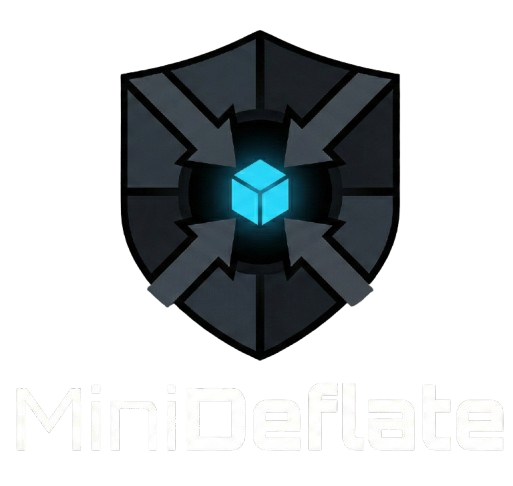

# MiniDeflate



**A production-grade, single-file DEFLATE-style compressor and archive engine written in portable C99.**

[]()
[]()
[]()
[]()

MiniDeflate is a compact archive and compression utility implemented as a single C99 compilation unit with zero third-party runtime dependencies. It combines a bounded hash-chain LZSS front end, RFC 1951-inspired distance coding, canonical Huffman block coding, and a hardened extraction pipeline into an implementation that is small enough to audit in one file but rich enough to serve as a serious engineering tool.

The codebase compresses individual files and directory trees, supports an optional solid mode for cross-file dictionary reuse, validates inputs aggressively against 27 documented security controls, and provides detached RSA/SHA-256 signature verification before extraction begins.

---

## Table of Contents

- [Design Philosophy](#design-philosophy)
- [Build and Installation](#build-and-installation)
- [Command-Line Interface](#command-line-interface)
- [Archive Format Specification](#archive-format-specification)
- [Compression Architecture](#compression-architecture)
- [Decompression Architecture](#decompression-architecture)
- [Security Architecture](#security-architecture)
- [Performance Characteristics](#performance-characteristics)
- [Technical Parameters](#technical-parameters)
- [Test Suite](#test-suite)
- [Error Reference](#error-reference)
- [Release History](#release-history)
- [License](#license)

---

## Design Philosophy

MiniDeflate is shaped by five persistent constraints: a single-file codebase, portable C99 semantics, a compact custom archive format, fail-closed extraction behavior, and performance optimizations that remain explainable under audit.

Three implementation choices define the design:

1. **Predictable bounded work over heroic search depth.** The match finder is deliberately constrained, the lazy parser is simple, and blocks may flush early when symbol statistics are unlikely to improve further.

2. **Publication safety over convenience.** Extraction occurs into temporary files or staging trees and is only committed after consistency checks succeed. Corrupt or hostile archives never leave partial output behind.

3. **Integrity and authenticity as separate layers.** CRC32 catches accidental corruption. Optional detached RSA/SHA-256 signatures protect the exact archive bytes against intentional tampering.

---

## Build and Installation

MiniDeflate compiles as a single translation unit with any C99-conformant compiler. No build system, configuration step, or external library is required.

```bash
# Production build
gcc -O3 -std=c99 -Wall -Wextra -Werror deflate.c -o deflate

# Debug build (enables assertions and diagnostic output)
gcc -O0 -g -std=c99 -Wall -Wextra -DDEBUG deflate.c -o deflate_debug
```

The resulting binary is self-contained. It links only against the C standard library and POSIX runtime facilities already present on the target platform.

**Supported platforms:** Linux, macOS, FreeBSD, and Windows (MSVC, MinGW, or Clang).

---

## Command-Line Interface

### Synopsis

```
deflate [OPTIONS] -c <input> <output.proz>
deflate [OPTIONS] -d <archive.proz> <output>
deflate --verify --sig <file.sig> --pubkey <key.pem> <archive.proz>
```

### Options

| Flag | Long Form | Description |
|------|-----------|-------------|
| `-c` | `--compress` | Compress a file or directory into a `.proz` archive |
| `-d` | `--decompress` | Decompress an archive (format auto-detected from magic bytes) |
| `-s` | `--solid` | Enable solid mode for folder compression (cross-file dictionary) |
| `-q` | `--quiet` | Suppress all non-error output |
| `-v` | `--verbose` | Emit detailed progress and diagnostic information |
| `-V` | `--version` | Print version string and feature summary |
| `-h` | `--help` | Print usage information |
| | `--verify` | Verify a detached signature without extracting |
| | `--sig FILE` | Path to detached raw PKCS#1 v1.5 signature |
| | `--pubkey FILE` | Path to RSA public key in PEM or DER format |

### Usage Examples

```bash
# Single-file compression and decompression
./deflate -c document.pdf document.proz
./deflate -d document.proz document_restored.pdf

# Directory compression (normal and solid mode)
./deflate -c project/ project.proz
./deflate -c -s project/ project.proz        # solid: cross-file dictionary

# Directory extraction (existing output dirs allowed if names do not collide)
./deflate -d project.proz output/

# Signature verification before extraction
openssl genpkey -algorithm RSA -pkeyopt rsa_keygen_bits:2048 -out private.pem
openssl pkey -in private.pem -pubout -out public.pem
openssl dgst -sha256 -sign private.pem -binary -out project.sig project.proz
./deflate -d --sig project.sig --pubkey public.pem project.proz output/

# Verification-only mode (no extraction)
./deflate --verify --sig project.sig --pubkey public.pem project.proz

# Verbose compression with detailed progress
./deflate -v -c largefile.bin largefile.proz

# Quiet mode for scripted pipelines
./deflate -q -c data.bin data.proz
```

### Operational Limits

| Limit | Value |
|-------|-------|
| Maximum input size | 25 GB |
| Maximum output size | 50 GB |
| Maximum files per folder archive | 65,535 |
| Maximum archive path length | 512 bytes |
| Maximum block count per stream | 4,000,000 |

---

## Archive Format Specification

MiniDeflate uses a custom container format. It does **not** emit gzip, zlib, or raw RFC 1951 streams. Archives produced by MiniDeflate must be handled by MiniDeflate-compatible tooling.

All multi-byte integers are serialized **little-endian**. The compressed bitstream itself is written **MSB-first**.

### Single-File Archive (`PROZ` / `0x50524F5A`)

```
[4B magic: 0x50524F5A]
[compressed Huffman block stream]
[4B CRC32 over original plaintext bytes]
```

### Folder Archive (`PROF` / `0x50524F46`)

```
[4B magic: 0x50524F46]
[4B file count (uint32)]
[file table: for each file]
    [2B path length (uint16)]
    [N bytes: relative UTF-8 path with forward slashes]
    [8B original file size (uint64)]
[compressed block stream: all file contents concatenated]
[4B CRC32 over all original payload bytes]
```

### Solid Folder Archive (`PROS` / `0x50524F53`)

Identical layout to the folder archive. The difference is behavioral: the LZ sliding window and hash chain state persist across file boundaries rather than resetting at each file transition, which improves compression ratio on collections of similar files.

---

## Compression Architecture

### Front End: Tokenization

The compressor converts input bytes into a stream of **literal** tokens (emit a byte directly) and **match** tokens (emit a length and a backward distance referencing already-seen data). This is a bounded LZSS-style front end with a 4 KiB sliding window.

| Component | Implementation |
|-----------|---------------|
| Window | 4,096 bytes, doubled to 8,192 for safe wraparound lookahead |
| Hash function | 4-byte multiplicative hash (`2654435761 * packed_bytes >> (32 - 15)`) |
| Hash table | 32,768 heads (15-bit), one chain per bucket |
| Chain search | Two-phase: 8 fast candidates, then up to 128 total |
| Lazy parsing | Probes `pos+1` and prefers a literal when the next match is longer (threshold: 32) |
| Distance coding | RFC 1951 ladder: 30 symbolic codes + extra bits (v6.0: constant-time lookup) |

### v6.0 Parse-Loop Optimization

In previous versions, every byte advanced during a multi-byte match triggered a full `find_best_match()` call. v6.0 splits the operation: intermediate positions are still inserted into the hash chain to maintain dictionary quality, but the full match search runs only once for the next real parse position. This eliminates the dominant avoidable CPU cost in the compressor without changing match quality or output format.

### Block Encoding

Tokens are grouped into blocks of up to 32,768 entries. Each block is independently coded with a bounded-depth canonical Huffman model:

1. Symbol frequencies are accumulated inline during token generation (v6.0: no rescan).
2. A min-heap Huffman tree is built entirely on the stack (v6.0: zero per-block allocation).
3. Code depths are limited to 15 bits using the JPEG Annex K redistribution method.
4. Canonical codewords are assigned from the corrected depth histogram.
5. The block header serializes a 1-bit last-block flag, a 16-bit max-symbol index, and 4-bit packed code lengths.

Adaptive block flushing may terminate a block early when token statistics indicate that further accumulation is unlikely to improve the Huffman model.

### Folder Compression Pipeline

Directory compression proceeds through a snapshot-then-encode pipeline:

1. The source directory is traversed using `openat(O_NOFOLLOW)` on POSIX (symlinks are skipped).
2. All regular file contents are copied into a temporary snapshot stream on the same filesystem.
3. A file table recording relative paths and original sizes is written to the archive header.
4. The compressor encodes the snapshot stream. In normal mode, hash chains reset at file boundaries. In solid mode, dictionary state persists across files.

This design eliminates the source TOCTOU window: the compressor reads from a stable snapshot, not from live files that could change between discovery and encoding.

---

## Decompression Architecture

### Block Decoding

For each compressed block, the decompressor:

1. Reads the block header (last-block flag, max-symbol index, packed code lengths).
2. Validates the Huffman code table: oversubscription, undersubscription, EOB presence, and canonical prefix-freeness.
3. Builds a 12-bit fast decode lookup table for codes up to 12 bits.
4. Decodes symbols using the fast table for short codes and a bit-by-bit fallback for longer codes.
5. Expands literals and matches into a 4 KiB output window with CRC32 tracking.

### Staged Extraction

**Single-file extraction** writes to a temporary sibling file. Only after all blocks decode successfully, the CRC32 matches, and no trailing bytes remain does the temporary file get atomically renamed into place.

**Folder extraction** is stricter:

1. All archive paths and sizes are validated before any output.
2. Duplicate normalized output paths are rejected.
3. A temporary staging directory is created on the same filesystem.
4. Files are extracted into the staging directory only.
5. After payload verification and CRC32 confirmation, the staged tree is committed to the final destination via atomic rename.
6. On any failure, the staging directory is removed completely.

Existing output directories are allowed when extracted top-level names do not collide with pre-existing entries.

---

## Security Architecture

MiniDeflate implements **27 documented security fixes** organized into four categories.

### Path Safety

| Control | Mechanism |
|---------|-----------|
| Directory traversal (`../`) | Rejected by component-wise `is_safe_archive_path()` validation |
| Absolute paths | Blocked (Unix `/`, Windows `C:` drive prefixes) |
| Embedded null bytes | Detected and rejected to prevent path truncation attacks |
| Reserved Windows names | `CON`, `PRN`, `AUX`, `NUL`, `COMn`, `LPTn` rejected |
| Control characters | Bytes < 32 rejected in all path components |

### Symlink and TOCTOU Defenses

| Control | Mechanism |
|---------|-----------|
| Output leaf symlinks | `O_NOFOLLOW` on POSIX; reparse-point check on Windows |
| Intermediate path symlinks | `openat(O_NOFOLLOW)` walk on POSIX extraction rejects `ELOOP`/`ENOTDIR` |
| Output root symlinks | Checked before extraction begins |
| Source directory symlinks | `lstat()` skips symlinks during folder traversal |
| Source TOCTOU | Folder contents snapshotted before encoding begins |
| Extraction TOCTOU | Output staged in temporary directory, committed only after verification |

### Format Validation

| Control | Mechanism |
|---------|-----------|
| Huffman oversubscription | Kraft inequality check rejects invalid code tables |
| Huffman undersubscription | Rejected to prevent CPU amplification via undecodable bit patterns |
| EOB marker presence | Required in every block's canonical table |
| Canonical prefix-freeness | Pairwise prefix validation on all code entries |
| Match bounds | Length and distance validated against window and output state |
| Trailing archive bytes | Rejected after CRC footer |
| Block count | Bounded at 4,000,000 per stream |

### Resource Limits

| Control | Mechanism |
|---------|-----------|
| Input size | 25 GB enforced during streaming read |
| Output size | 50 GB enforced incrementally during decompression |
| File count | 65,535 per folder archive |
| Path length | 512 bytes per archive entry |
| Declared output size | Validated against actual decompressed bytes |

### Detached Signature Verification

MiniDeflate does not embed signatures in the archive. Instead, it verifies a detached raw RSA PKCS#1 v1.5 + SHA-256 signature over the exact archive bytes on disk. Verification can be used standalone (`--verify`) or as a prerequisite to extraction (`-d --sig --pubkey`). Failed verification aborts before any output is produced.

CRC32 is retained for accidental corruption detection. It is **not** treated as a cryptographic or authentication boundary.

---

## Performance Characteristics

### Compression Ratios

| Input Type | Size | Compressed | Ratio |
|------------|------|------------|-------|
| Repetitive text | 130 KB | 784 B | 0.6% |
| Source code (`deflate.c`) | 97 KB | 32.6 KB | 33.6% |
| Pseudorandom data | 512 KB | 528 KB | 100.8% |
| Zero-filled | 512 KB | 1.8 KB | 0.3% |

### v6.0 Throughput Improvements

The v6.0 compressor is measurably faster than v5.0 on structured input due to two algorithmic changes:

- **Parse-loop search/insert split.** Intermediate bytes inside a match are inserted into the hash chain but do not trigger full match search. Only the next real parse position pays for `find_best_match()`.
- **Constant-time distance coding.** A precomputed lookup table maps all distances in the 4 KiB window to their RFC 1951 code, extra-bit count, and extra-bit value, replacing a per-match binary search.

These changes preserve bitstream compatibility: archives produced by v6.0 are identical to those produced by v5.0 for the same input.

### Implementation-Level Optimizations (Cumulative)

| Optimization | Introduced | Effect |
|--------------|-----------|--------|
| Parse-loop search/insert split | v6.0 | Eliminates redundant match searches during multi-byte advances |
| Constant-time distance-code lookup | v6.0 | O(1) replaces O(log n) per match token |
| Allocation-free per-block Huffman | v6.0 | Heap metadata and node pool stay on the stack |
| Inline block frequency accumulation | v6.0 | Removes `encode_block()` token-buffer rescan |
| Batched bit I/O (56-bit accumulator) | v5.0 | Reads are a single shift+mask |
| 12-bit fast decode table | v5.0 | Common symbols resolved in one table access |
| Arena allocator for Huffman nodes | v5.0 | Stack-local node pool, zero `malloc`/`free` per block |
| CRC32 slice-by-4 | v5.0 | ~3-4x faster integrity checking |
| 64 KB I/O buffers | v5.0 | 4x larger than v4.0 |
| `getc_unlocked` on POSIX | v5.0 | Eliminates per-byte stdio mutex overhead |
| Buffered decompression output | v5.0 | `WriteBuf` replaces per-byte `fputc` |
| Two-phase chain search (8 fast / 128 full) | v4.0 | Bounded search depth with fast-path for short matches |
| 4-byte multiplicative hash | v4.0 | Better distribution than additive hash |
| Adaptive block flushing | v4.0 | Early block termination when statistics plateau |

---

## Technical Parameters

| Parameter | Value | Notes |
|-----------|-------|-------|
| Sliding window | 4,096 bytes | Doubled to 8,192 for safe lookahead |
| Maximum match length | 258 bytes | Per RFC 1951 length-code space |
| Minimum match length | 3 bytes | |
| Block capacity | 32,768 tokens | |
| Hash table entries | 32,768 (15-bit) | |
| Hash chain depth | 128 (8 fast + 120 full) | |
| Lazy match threshold | 32 | Matches >= 32 accepted without lazy probe |
| Distance codes | 30 | RFC 1951 compliant |
| Maximum Huffman depth | 15 bits | |
| Fast decode table | 4,096 entries (12-bit) | |
| I/O buffer size | 65,536 bytes | |
| CRC32 algorithm | Slice-by-4 (4 KB tables) | |
| Symbol count | 513 | 256 literals + 256 length codes + EOB |
| Bit accumulator width | 64 bits (56 usable) | |

---

## Test Suite

```bash
bash test/advanced_cli_tests.sh
```

The suite builds `deflate.c` from source in a disposable temporary directory and exercises the resulting binary through **43 test cases** organized into five categories:

| Category | Tests | Coverage |
|----------|-------|----------|
| **A: CLI Parsing** | 8 | Every documented flag, conflicting options, missing arguments |
| **B: Data Round-Trips** | 12 | Mixed payloads, single byte, all zeros, incompressible PRNG, nested folders, solid mode, empty files, multi-block, absolute paths |
| **C: Format Validation** | 12 | Magic bytes, truncation, declared-size corruption, trailing data, duplicate paths, malformed Huffman, mutation fuzz (100 random byte flips), signature verification |
| **D: Security Hardening** | 9 | CRC tampering, path traversal injection, output symlink blocking, staged cleanup on failure, flexible output directories, signature-gated extraction |
| **E: Output Modes** | 2 | Verbose detail emission, quiet mode suppression |

Prerequisites: a C99 compiler (`cc` or `$CC`), `python3`, `diff`, `cmp`, and `ln -s`. Typical run time is approximately 2 seconds.

See [`test/README.md`](test/README.md) for per-test specifications.

---

## Error Reference

| Code | Constant | Description |
|------|----------|-------------|
| 0 | `DEFLATE_OK` | Operation completed successfully |
| -1 | `DEFLATE_ERR_IO` | File I/O error (read, write, or stream failure) |
| -2 | `DEFLATE_ERR_MEM` | Memory allocation failed |
| -3 | `DEFLATE_ERR_FORMAT` | Invalid or unrecognized archive format |
| -4 | `DEFLATE_ERR_CORRUPT` | Data corruption detected (CRC mismatch, invalid Huffman, bad match) |
| -5 | `DEFLATE_ERR_LIMIT` | Configured size or count limit exceeded |
| -6 | `DEFLATE_ERR_PATH` | Unsafe or invalid path rejected by security controls |
| -7 | `DEFLATE_ERR_AUTH` | Detached signature verification failed |

---

## Release History

| Version | Highlights |
|---------|------------|
| **6.0** | Parse-loop search/insert split, constant-time distance coding, allocation-free Huffman heap, inline block frequency accumulation |
| **5.0** | 25 GB/50 GB limits, arena allocator, batched bit I/O, zero-copy decode, CRC32 slice-by-4, `openat` extraction, 27 security fixes |
| **4.0** | RFC 1951 distance coding, solid mode, 4-byte hash, adaptive blocks, professional CLI |
| **3.0** | Folder compression and archive support |
| **2.0** | Security hardening (18 fixes) |
| **1.0** | Initial release |

---

## License

Copyright (c) 2026 [GuestAUser](https://github.com/GuestAUser). All rights reserved.

Proprietary software. Unauthorized copying, modification, distribution, or use is strictly prohibited without prior written permission from the copyright holder.
